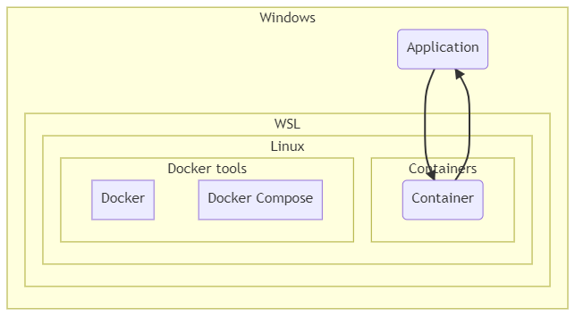
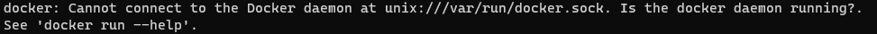
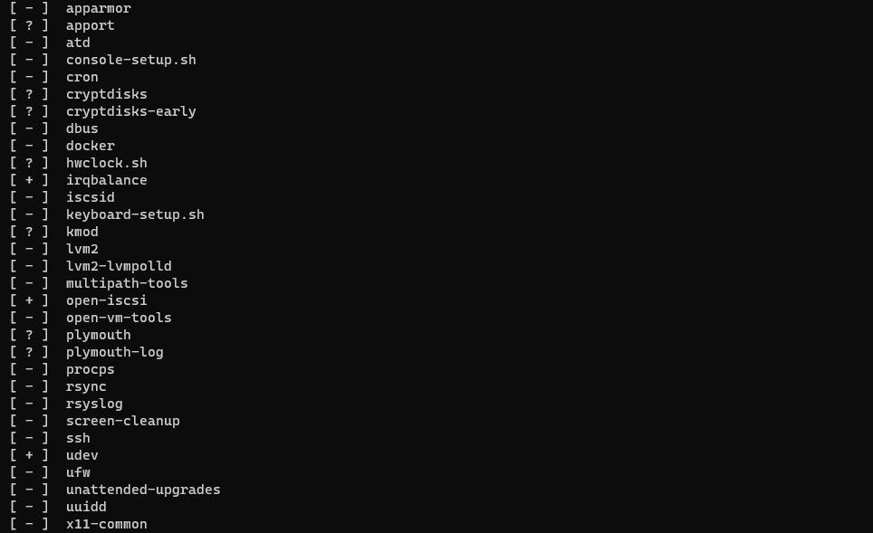
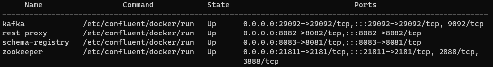
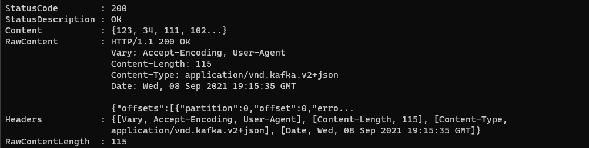
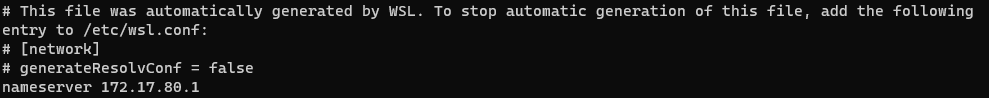
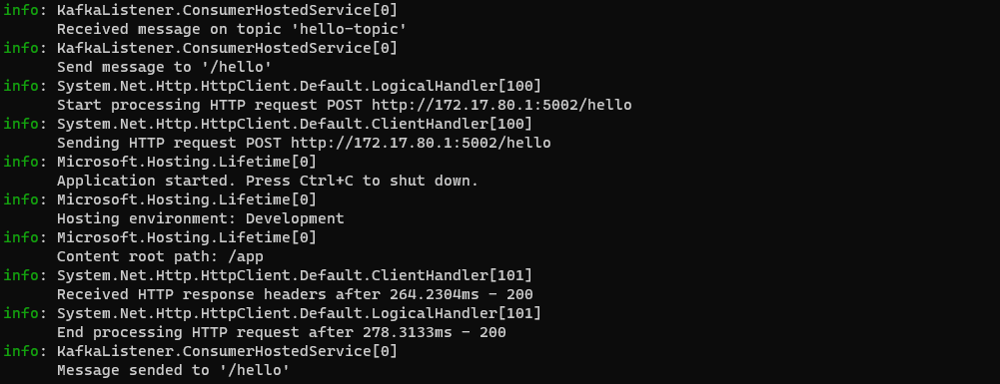

# WSL2 + Docker without Desktop - Communicate with Windows Host

## Preface

This post present a solution to stop using Docker Desktop and use only Docker Engine on WSL.

I decide to use :
- WSL2
- Ubuntu 20.04
- Docker Engine for Linux
- Docker Compose for Linux

I want to do something like this :



## Prerequisite

- Install WSL version 2 (see [Microsoft documentation](https://docs.microsoft.com/en-us/windows/wsl/install-win10))
- Install Linux (personally I choose [Ubuntu](https://www.microsoft.com/fr-ca/p/ubuntu-2004-lts/9n6svws3rx71))
- Clone this repository
- Have the rights to modify the configuration of the Windows firewall

## Configure WSL

You maybe need to configure WSL to limit processor and memory usage.

This can be done with the file `.wslconfig` in your Windows profile folder (%USERPROFILE%).

```
[wsl2]
memory=4GB   # Limits VM memory in WSL 2 up to 4GB
processors=2 # Makes the WSL 2 VM use two virtual processors
```

See [Microsoft documentation](https://docs.microsoft.com/en-us/windows/wsl/wsl-config#configure-global-options-with-wslconfig).

## Install Docker tools

### Install Docker

From [Docker documentation](https://docs.docker.com/engine/install/ubuntu/) :

**WSL TERMINAL :**

``` console
sudo apt-get update
```
``` console
sudo apt-get install apt-transport-httca-certificates curl gnupg lsb-release
```
``` console
curl -fsSL https://download.docker.com/linux/ubuntu/gpg | sudo gpg --dearmor -o /usr/share/keyrings/docker-archive-keyring.gpg
```
``` console
echo \
  "deb [arch=amd64 signed-by=/usr/share/keyrings/docker-archive-keyring.gpg] https://download.docker.com/linux/ubuntu \
  $(lsb_release -cs) stable" | sudo tee /etc/apt/sources.list.d/docker.list > /dev/null
```
``` console
sudo apt-get update
```
``` console
sudo apt-get install docker-ce docker-ce-cli containerd.io
```
``` console
sudo docker run hello-world
```

You will have an error here :



Docker service didn't start automatically in WSL, even if you reboot Ubuntu, since `systemd` is not enabled.

**WSL TERMINAL :**

``` console
service --status-all
```



You can start it manually :

**WSL TERMINAL :**

``` console
sudo service docker start
```

Allow Docker without `sudo` (see [Docker post installation documentation](https://docs.docker.com/engine/install/linux-postinstall/))

**WSL TERMINAL :**

``` console
sudo groupadd docker
```
``` console
sudo usermod -aG docker $USER
```
``` console
newgrp docker 
```
``` console
docker run hello-world
```

### Install Docker Compose

**WSL TERMINAL :**

``` console
sudo apt update
```
``` console
sudo apt install docker-compose
```

## Start multi-container with Docker Compose

Let's try to start a Kafka environment with Docker Compose, my `docker-compose.yml` file can be found in the src folder.

**WSL TERMINAL :**

``` console
docker-compose up -d
```


``` console
docker-compose ps
```



## Communicate with the containers from Windows

Ok, we have a Kafka environment in WSL, now let's try to send a message.

**WSL TERMINAL :**

``` console
curl http://localhost:8082/topics -w "\n"
```


> Only one topic.

**WINDOWS POWERSHELL :**

``` powershell
Invoke-WebRequest -Uri 'http://[::1]:8082/topics/hello-topic' -Method POST -ContentType 'application/vnd.kafka.json.v2+json' -Body '{"records":[{"value":{"Message": "Hello Kafka!"}}]}' -UseBasicParsing
```




**WSL TERMINAL :**

``` console
curl http://localhost:8082/topics -w "\n"
```


> Topic has been created.

<span style="color:red">To communicate with the container, you must use this address **[::1]**.</span>

## Communicate with Windows from the containers

Ok, now let's try to communicate with Windows host. You can read the [Microsoft documentation](https://docs.microsoft.com/en-us/windows/wsl/compare-versions#accessing-windows-networking-apps-from-linux-host-ip).

First, we have to find his IP address :

**WSL TERMINAL :**

```bash
cat /etc/resolv.conf
```



Secondly, we have to configure the firewall to authorize communication  :

**WINDOWS POWERSHELL :**

``` powershell
# Run as Administrator
New-NetFirewallRule -DisplayName "WSL" -Direction Inbound -InterfaceAlias "vEthernet (WSL)" -Action Allow
```

Finally, we start Kafka environnement with a listener application.

__Note__ : you have to fix the IP address in the file `docker-compose.listener.yml` :

``` yaml
ListenerConfig__Host: http://172.17.80.1:5002
```

**WSL TERMINAL :**

``` console
docker-compose -f docker-compose.yml -f docker-compose.listener.yml up -d --build && docker attach listener
```

Then, let's start an application on the host to handle HTTP message :

**WINDOWS POWERSHELL :**

``` powershell
# Use the WSL IP address
dotnet run --urls "http://172.17.80.1:5002"
```

Send a message to Kafka :

**WINDOWS POWERSHELL :**

``` powershell
Invoke-WebRequest -Uri 'http://[::1]:8082/topics/hello-topic' -Method POST -ContentType 'application/vnd.kafka.json.v2+json' -Body '{"records":[{"value":{"Message": "Hello Kafka!"}}]}' -UseBasicParsing
```

You should see this message in both applications :

**WSL TERMINAL :**




**WINDOWS POWERSHELL :**


## Conclusion

This solution work, but I found the following irritating:
- Dealing with the firewall is not simple
- The Host IP address changes

While I was testing the solution, I had the conviction that the Windows Host is useless.

In a next tutorial, I will present a solution that uses only WSL. Furthermore, Visual Studio 2019 work very well with WSL.

## References

- https://docs.microsoft.com/en-us/windows/wsl/install-win10
- https://docs.microsoft.com/en-us/windows/wsl/wsl-config#configure-global-options-with-wslconfig
- https://docs.docker.com/engine/install/ubuntu
- https://docs.docker.com/engine/install/linux-postinstall
- https://docs.microsoft.com/en-us/windows/wsl/compare-versions#accessing-windows-networking-apps-from-linux-host-ip
- https://github.com/microsoft/WSL/issues/4983
- https://itnext.io/wsl2-tips-limit-cpu-memory-when-using-docker-c022535faf6f
- https://www.bleepingcomputer.com/news/microsoft/windows-10-wsl2-now-allows-you-to-configure-global-options
- https://superuser.com/questions/1553771/wsl2-can-not-access-windows-ip-retreived-by-ip-route-grep-default-awk-pr
